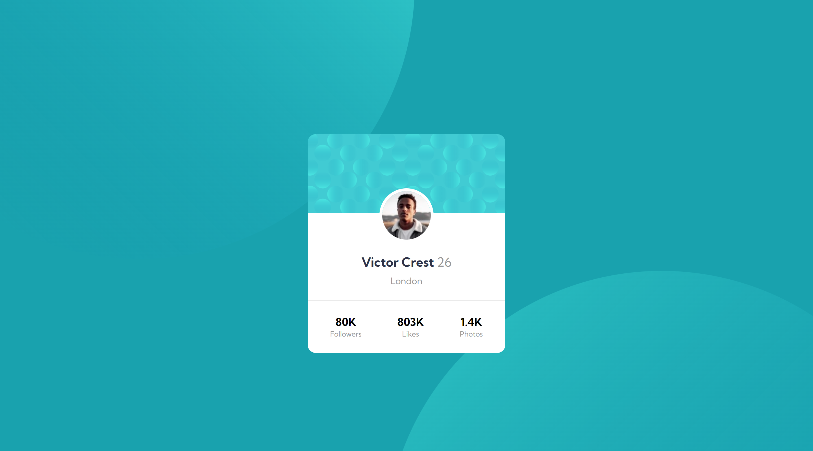

# Frontend Mentor - Profile card component solution

This is a solution to the [Profile card component challenge on Frontend Mentor](https://www.frontendmentor.io/challenges/profile-card-component-cfArpWshJ). Frontend Mentor challenges help you improve your coding skills by building realistic projects. 

## Table of contents

- [Overview](#overview)
  - [The challenge](#the-challenge)
  - [Screenshot](#screenshot)
  - [Links](#links)
- [My process](#my-process)
  - [Built with](#built-with)
  - [What I learned](#what-i-learned)
  - [Continued development](#continued-development)
  - [Useful resources](#useful-resources)
- [Author](#author)
- [Acknowledgments](#acknowledgments)

**Note: Delete this note and update the table of contents based on what sections you keep.**

## Overview

### The challenge

- Build out the project to the designs provided

### Screenshot

### Links

- Solution URL: [GitHub](https://github.com/sledua/fm-profile-card-component-main)
- Live Site URL: [Live site Profile card component](https://calm-malabi-d05449.netlify.app/)

## My process

### Built with

- Semantic HTML5 markup
- CSS custom properties
- CSS Grid
- !Mobile-first workflow

### What I learned

I improved my layout skills, and the mobile version is the main one. I used only the necessary tags from HTML5 and checked my work thoroughly with a validator. (Thanks to the community for commenting on my pages, I listen to you) There could be a lot of watered-down explanations that only I need, so I write comments in the code.  

### Continued development

Use this section to outline areas that you want to continue focusing on in future projects. These could be concepts you're still not completely comfortable with or techniques you found useful that you want to refine and perfect.

### Useful resources

## Author

- Website - [sledua](https://github.com/sledua)
- Frontend Mentor - [@sledua](https://www.frontendmentor.io/profile/sledua)
- Twitter - [@ua_sled](https://twitter.com/ua_sled)

## Acknowledgments

This is where you can give a hat tip to anyone who helped you out on this project. Perhaps you worked in a team or got some inspiration from someone else's solution. This is the perfect place to give them some credit.

